# Jenkins AWS Demo

# Introduction & Goals
- The goal of the project was to use Jenkins to assist in CI/CD to automatically deploy a new cloudformation stack when there was a new commit on a github repo.

# Tools Used
- Jenkins
- CloudFormation
- S3
- Systems Manager

# Process
- Create a Role for EC2. We'll give this role access to S3, CloudFormation, and Systems Manager so that we don't have to worry about using access keys.

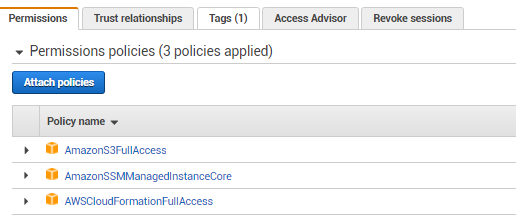

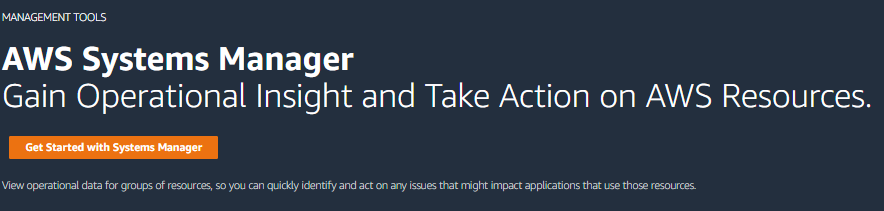

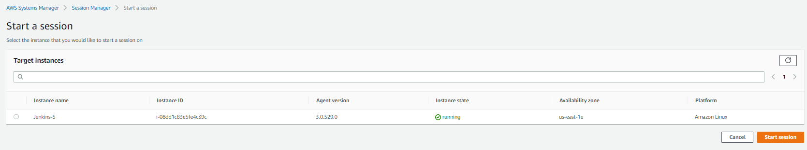

- Create a new EC2. I'm using a AWS linux EC2 t2 micro instance.

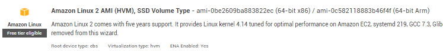

- In the security group, add port 8080.

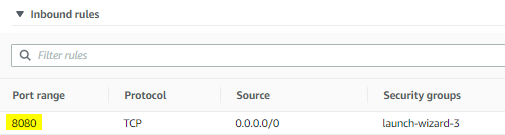

- I downloaded Jenkins onto this instance using the template from this link: https://www.jenkins.io/doc/book/installing/linux/#red-hat-centos. Once installed, run Jenkins:
  - sudo systemctl start jenkins
  - sudo systemctl status jenkins
  - sudo systemctl stop jenkins

- Copy the public IPv4 address and add :8080 on the end of the URL

- Once loggedin, add the jenkins-cloudformation-plugin

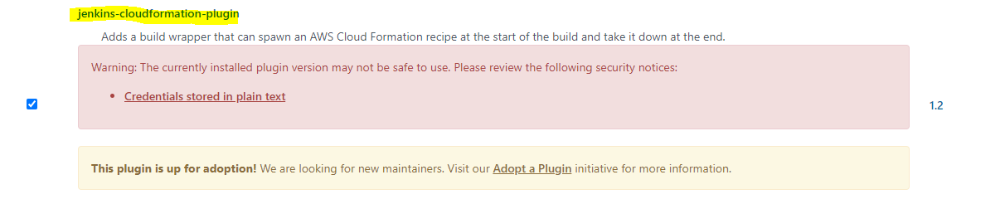

- Create a new pipeline build 

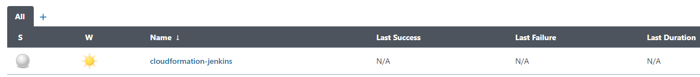

- Choose 'github hook trigger'

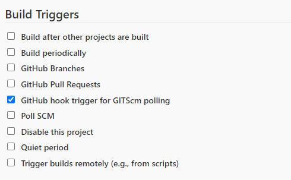

- Connect the github repo by pasting the URL and adding credentials

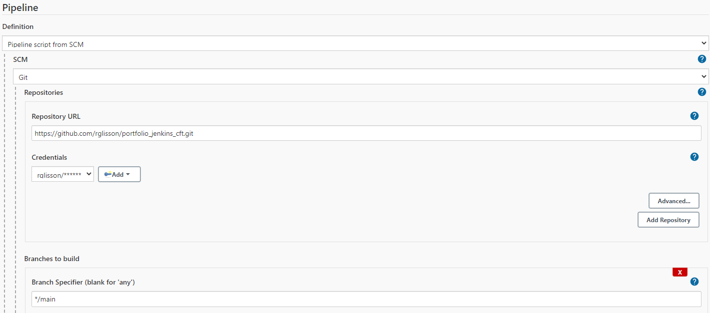

- Type the jenkins file name, which I have under 'jenkinsfile' in my repo

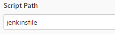

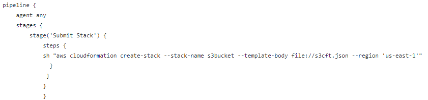

- Here's the cloudformation JSON script. This will simply add a new S3 bucket.

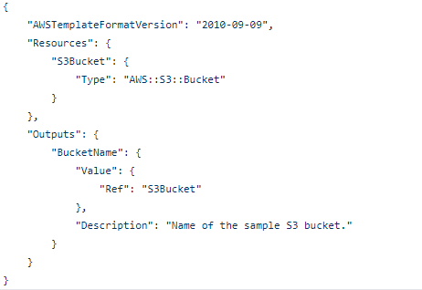

- In order to trigger new commits to the pipeline, in github go to settings, webhooks, and add the following:

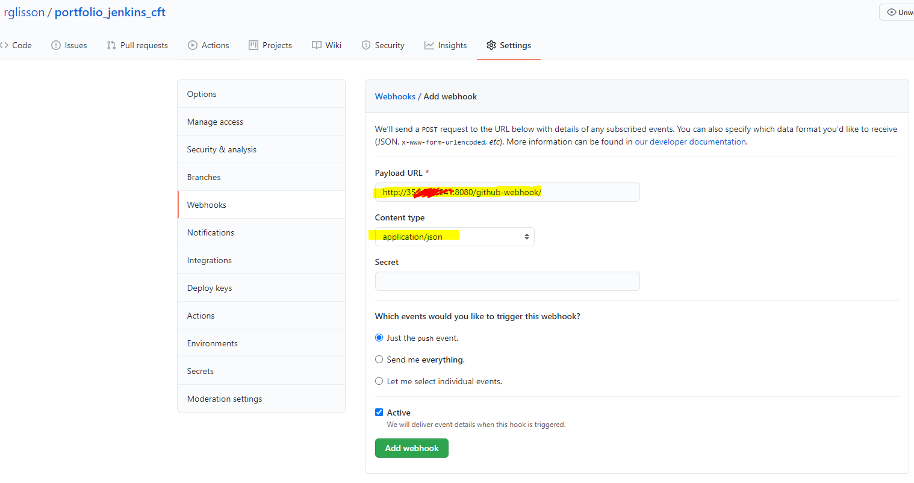

- Now, whenever we make a new commit, jenkins runs a new build immediately. 

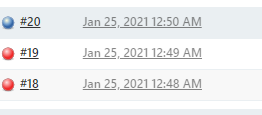

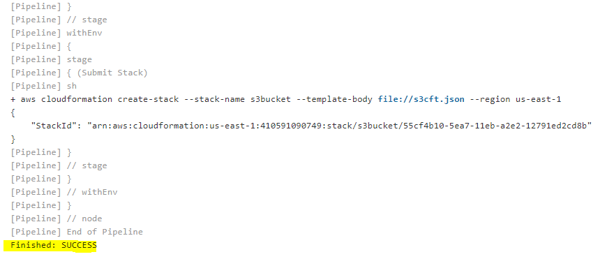

- Output of CloudFormation stack:

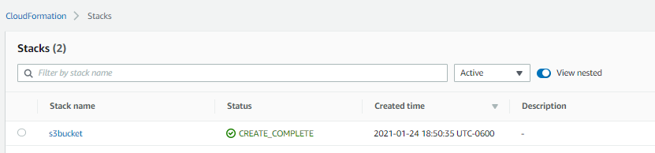

- Output of S3 bucket:

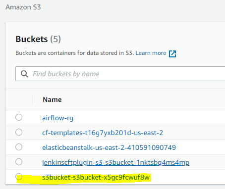

- Jenkins pipeline UI

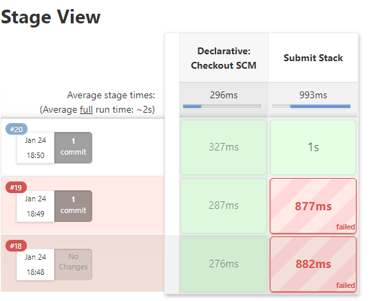

# Conclusion
- Jenkins is a universal automation software tool. Once configured on AWS, you can configure your CI/CD pipelines. In this case I downloaded a CloudFormation plugin to automatically deploy my infrastructure-as-code everytime I make a new commit on my github repo.
